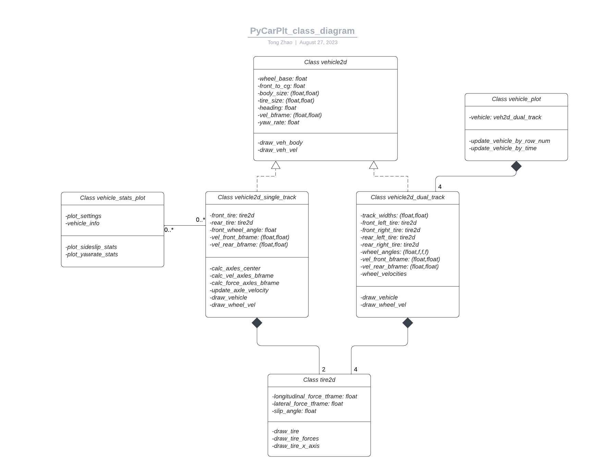

# PyCarPlt
A python matplotlib-based plotting library for car-related vector images

## Python package requirements
Numpy, Matplotlib, Pandas, Seaborn (tested in Python 3.8)

## Features
- draws nice vector image of vehicle force diagrams
- supports view in both SAE J670 z-up and z-down conventions
- supports reading vehicle pose data in csv format
- supports both single-track and dual-track vehicle drawings
- supports mannual animation using a slider bar

## Get started
An examplary script is provided in `example_single_track.ipynb`. 
A slider bar animation is provided in `example_animate.py`. Run from the project root directory.

The class structure is visualized in `doc/pyCarPlt_class_diagram.png`:

## Additional Resource for authors of this repo:
- [How to annotate graph with text and arrow](https://jakevdp.github.io/PythonDataScienceHandbook/04.09-text-and-annotation.html)